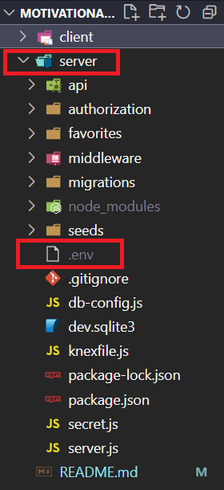
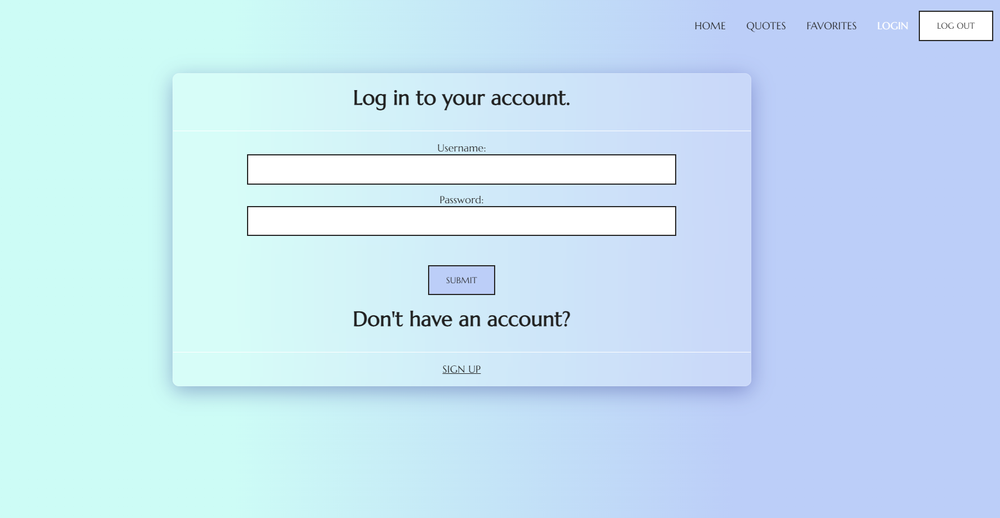
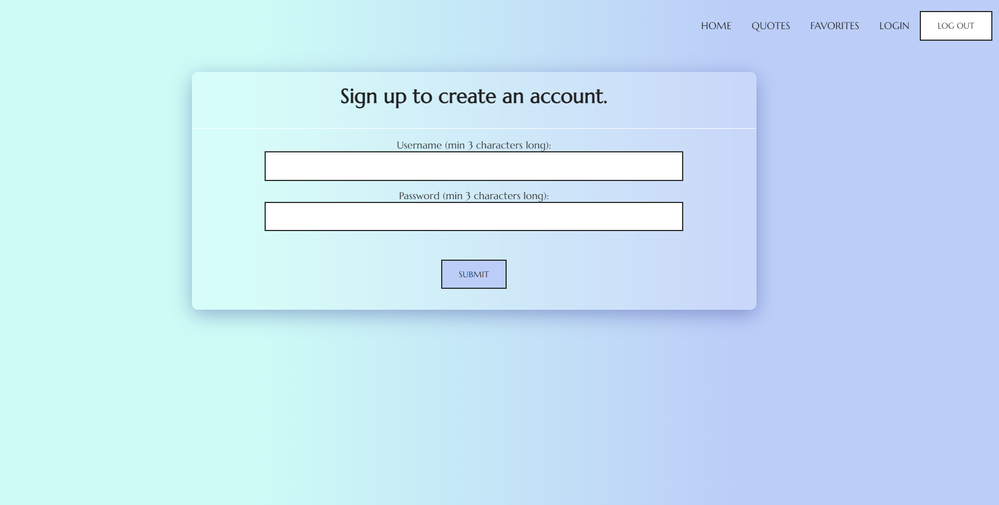
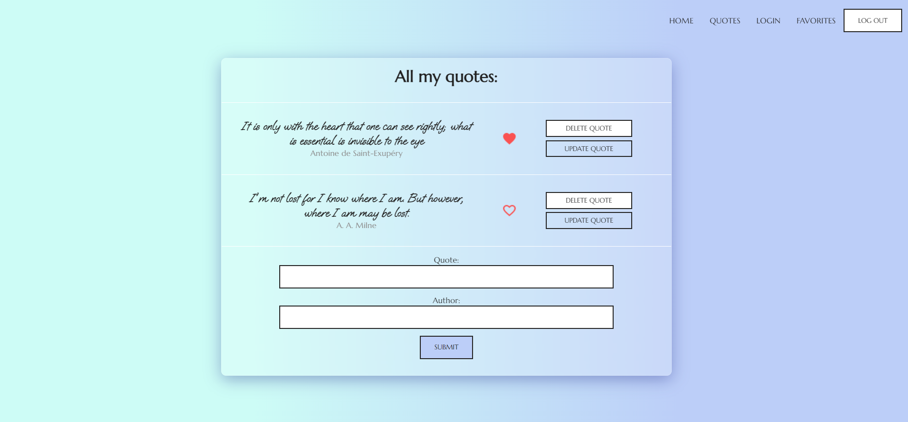
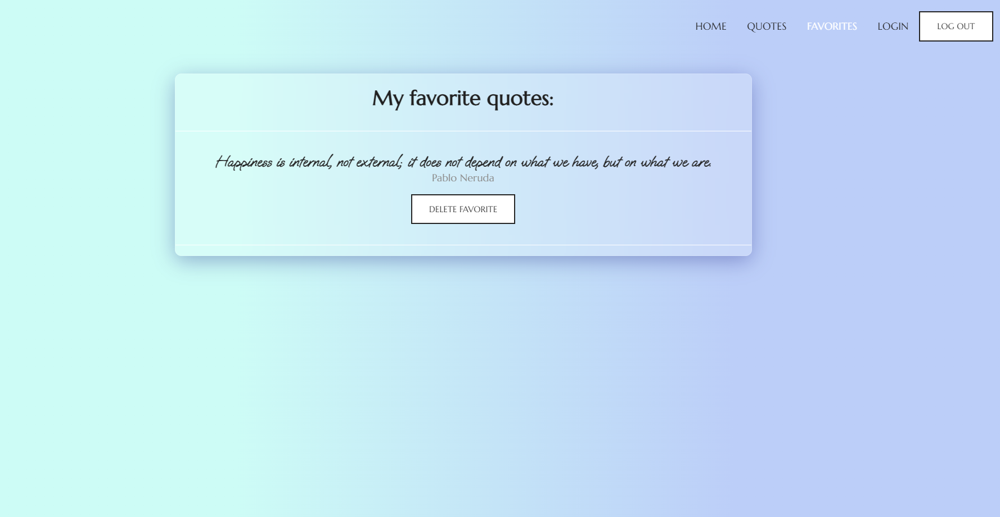

## Progress notes:

* Express and nodemon were installed. Server was created. React was added. Client side and server side were connected with each other.
* Knex and knex seeds were added and a basic SQLite database was created and migrated.
* Express router was created.
* Config file was created and an API endpoint to access backend data was added and tested.
* Backend database model for quotes was created
* Backend database router for quotes was created with GET, POST, DELETE, and PUT requests
* GET, POST, DELETE, and PUT requests were connected to the client side.
* Home, Sign up, and Login components were created. A form was added to both Sign up and Login.
* Backend database model was updated to include username and password 
* POST request for user registration was created and user's password got hashed via bcrypt and stored on the server.
* POST request for user login was created and upon successful credentials verification, a JWT token was generated.
* A JWT token was stored in localStorage on the client side.
* A headers authorization request was made to the quotes component to make it into a private route, accessible only when the JWT token is verified.
* Error handling middleware was created to display backend errors on the client end when wrong credentials are entered during login.
* Error handling middleware was created to display backend errors on the client side when certain requirements are not met during registration.
* A Favorites Component was added, and a backed database model was updated to include favorites data in reference to the quotes data.
* Toggling of favorites with POST and DELETE requests was added to the Quotes component to add/delete  from favorites.
* DELETE request was added to the Favorites component to delete quotes from favorites.
* The application was styled using CSS.

## This application uses encryption protocols and as such you will need to create your own JWT secret for it to work. After cloning the project, please follow the instructions in this specific order:

1. Create an .env file inside the root directory of the server folder. Here's a screenshot:


2. Inside the .env file, place the following line of code and substitute the JWT secret with your own:
```bash
JWT_SECRET = "any-secret-you-want"
```

3. Open your first terminal and run the server-side:
```bash
cd server
npm install
npm run server
```

4. Open your second terminal and run the client-side:
```bash
cd client
npm install
npm start
```

## Backend enpoints and schemas:

## http://localhost:9000
### For list of all users:
```bash
GET /auth
{
    "id": 1,
    "username": "",
    "password": ""
}
```
### To sign up:
```bash
POST /auth/register
{
    "username": "",
    "password": ""
}
```
### To log in:
```bash
POST /auth/login
{
    "username": "",
    "password": ""
}
```
### For all quotes:
```bash
GET /api
{
    "id": 1,
    "quote": ""
    "author": ""
}
```
### For all favorite quotes:
```bash
GET /favorites
{
    "id": 1,
    "favorites_id": 1, 
    "favoriteQuote": "",
    "favoriteAuthor": ""
}
```

## Project screenshots:











